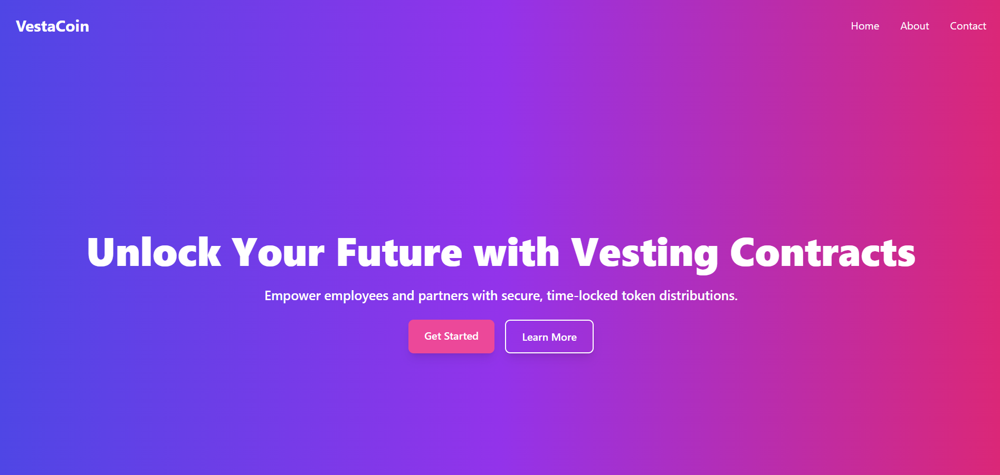

# 📜 Time-Locked Token Vesting Contract



This project implements a **token vesting smart contract** using Clarity on the Stacks blockchain. It ensures that employees or partners receive their allocated tokens according to predefined schedules, incentivizing long-term participation. This contract offers features like **cliff periods, vesting intervals, and early exit penalties**.  

---

## 🚀 Features

- **Customizable Vesting Schedules:**  
  Supports multiple schedules (e.g., monthly or yearly).
- **Cliff Periods:**  
  A period before any tokens are released.
- **Revocable Schedules:**  
  Option to revoke schedules if needed.
- **Claim Tokens:**  
  Beneficiaries can claim vested tokens periodically.
- **Penalty for Early Exit:**  
  If a schedule is revoked, only vested tokens are claimable.

---

## 📂 Project Structure

```bash
.
├── contracts/
│   └── token-vesting.clar   # Clarity contract source
├── tests/
│   └── token-vesting.test.ts         # Test suite using Vitest
└── README.md                   # Documentation (this file)
```

---

## 🛠️ Setup and Installation

### Prerequisites

- **Node.js** and **npm** installed  
- **Clarinet** for smart contract development:  
  Install it globally with:

  ```bash
  npm install -g @clarigen/clarinet
  ```

- **Vitest** for testing in TypeScript:  
  Install it using:

  ```bash
  npm install vitest --save-dev
  ```

---

## ⚙️ Usage

### 1. Compile the Contract

Use Clarinet to compile the contract:

```bash
clarinet check
```

### 2. Deploy the Contract

To deploy the contract, create a deployment configuration file and run:

```bash
clarinet deploy
```

### 3. Run Tests

Execute the tests using Vitest:

```bash
npm test
```

---

## 📜 Contract Functions

### 1. **Create Vesting Schedule**

```clarity
(define-public (create-vesting-schedule ...))
```

**Description:** Initializes a new vesting schedule for a beneficiary.  
**Parameters:**
- `beneficiary`: Principal address of the beneficiary.
- `total-amount`: Total tokens to be vested.
- `start-block`: Block height when vesting starts.
- `cliff-length`: Number of blocks before the first token release.
- `vesting-length`: Total duration for the entire vesting.
- `vesting-interval`: Interval between token releases.
- `is-revocable`: Whether the schedule can be revoked.

**Returns:**  
- `{ success: true }` on success or error codes.

---

### 2. **Claim Tokens**

```clarity
(define-public (claim-tokens))
```

**Description:** Allows beneficiaries to claim their vested tokens.  
**Returns:**  
- `{ success: true, claimedAmount: uint }` on success or error codes.

---

### 3. **Revoke Schedule**

```clarity
(define-public (revoke-schedule (beneficiary principal)))
```

**Description:** Allows the contract owner to revoke a vesting schedule.  
**Returns:**  
- `{ success: true, unclaimedTokens: uint }` on success or error codes.

---

### 4. **Get Claimable Tokens**

```clarity
(define-read-only (get-claimable-tokens (beneficiary principal)))
```

**Description:** Calculates the number of tokens that the beneficiary can claim based on the current block height.

---

## 🧪 Test Cases

The test suite, located in `tests/vesting_test.ts`, includes the following tests:

1. **Creating a Vesting Schedule:**  
   Verifies that only the contract owner can create schedules.
   
2. **Calculating Claimable Tokens:**  
   Simulates block height to test claimable token calculations.

3. **Claiming Tokens:**  
   Tests if beneficiaries can claim vested tokens.

4. **Revoking a Schedule:**  
   Checks if revocation works correctly and returns unclaimed tokens.

---

## 📢 Error Codes

- **100:** Not authorized (only the owner can perform this action).
- **101:** Schedule already exists and is active.
- **102:** Schedule not found or inactive.
- **103:** Invalid schedule configuration.
- **104:** No tokens available to claim.

---

## 🛡️ Security Considerations

- Ensure only authorized addresses (like the owner) can create or revoke schedules.
- Token transfer logic needs to be integrated to move actual tokens on claim.
- Prevent double-spending by carefully updating the `tokens-claimed` state.

---

## 📄 License

This project is licensed under the MIT License. See the [LICENSE](LICENSE) file for more details.

---

## 🤝 Contributing

Contributions are welcome! Please fork the repository, create a feature branch, and submit a pull request.

---


